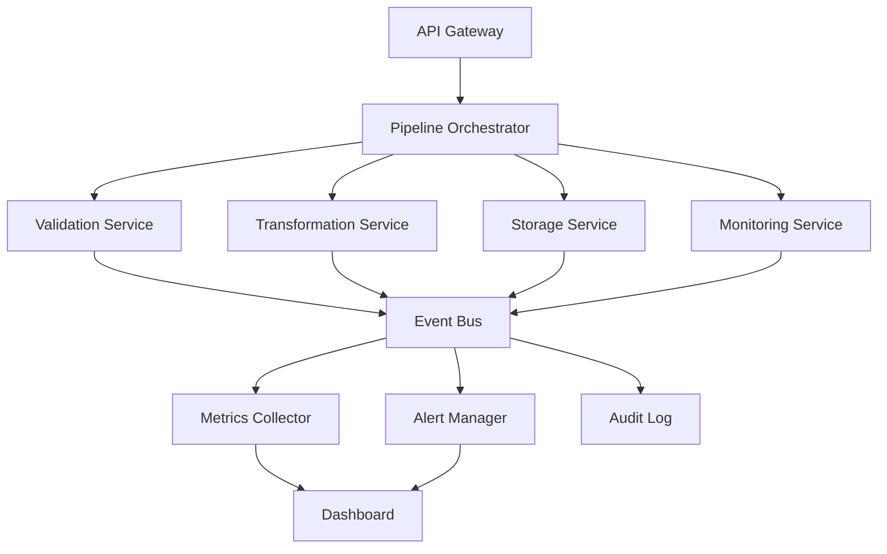
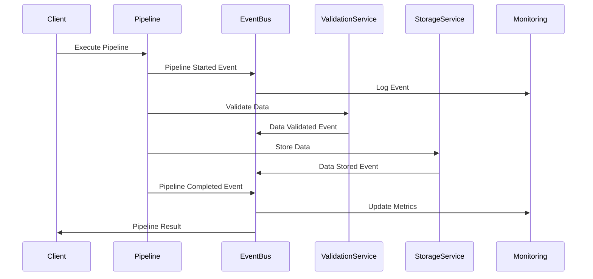
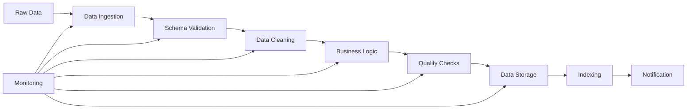
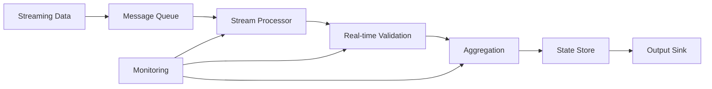
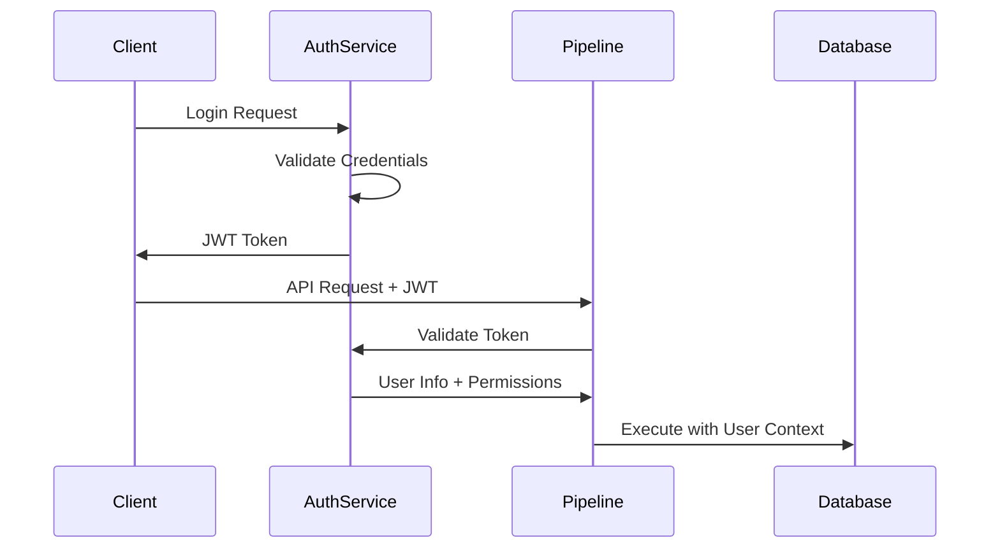
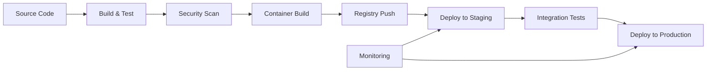

# Architecture Documentation

## 🏗️ System Architecture Overview

The Data Pipeline Framework is built on modern enterprise architecture principles, designed for scalability, reliability, and maintainability.

## 📐 Architectural Patterns

### 1. Microservices Architecture



### 2. Event-Driven Architecture (CQRS)



### 3. Layered Architecture

```
┌─────────────────────────────────────┐
│           Presentation Layer         │
│  ┌─────────────┐  ┌─────────────────┐│
│  │ Web Dashboard│  │ REST API        ││
│  │             │  │                 ││
│  └─────────────┘  └─────────────────┘│
└─────────────────────────────────────┘

┌─────────────────────────────────────┐
│          Application Layer          │
│  ┌─────────────┐  ┌─────────────────┐│
│  │ CLI Commands│  │ Pipeline        ││
│  │             │  │ Orchestrator    ││
│  └─────────────┘  └─────────────────┘│
└─────────────────────────────────────┘

┌─────────────────────────────────────┐
│           Business Layer            │
│  ┌─────────────┐  ┌─────────────────┐│
│  │ Processing  │  │ Validation      ││
│  │ Services    │  │ Services        ││
│  └─────────────┘  └─────────────────┘│
└─────────────────────────────────────┘

┌─────────────────────────────────────┐
│         Infrastructure Layer        │
│  ┌─────────────┐  ┌─────────────────┐│
│  │ Data Sources│  │ Storage         ││
│  │ (CSV/S3/DB) │  │ (PostgreSQL)    ││
│  └─────────────┘  └─────────────────┘│
└─────────────────────────────────────┘
```

## 🔧 Core Components

### Pipeline Orchestrator

**Responsibilities:**
- Coordinate execution of data processing steps
- Manage component lifecycle
- Handle error recovery and retries
- Emit events for monitoring

**Key Features:**
- Dynamic configuration loading
- Plugin-based extensibility
- Resource management
- State persistence

```python
# Example: Pipeline Orchestrator
class PipelineOrchestrator:
    def __init__(self, config: Config, event_bus: EventBus):
        self.config = config
        self.event_bus = event_bus
        self.components = self._initialize_components()
    
    async def execute(self, pipeline_config: Dict) -> ExecutionResult:
        pipeline_id = str(uuid.uuid4())
        
        try:
            # Emit start event
            await self.event_bus.publish(
                PipelineStartedEvent(pipeline_id, pipeline_config)
            )
            
            # Execute pipeline steps
            result = await self._execute_steps(pipeline_config)
            
            # Emit completion event
            await self.event_bus.publish(
                PipelineCompletedEvent(pipeline_id, result)
            )
            
            return result
            
        except Exception as e:
            await self.event_bus.publish(
                PipelineFailedEvent(pipeline_id, str(e))
            )
            raise
```

### Event Bus System

**Design Pattern:** Publisher-Subscriber with Event Sourcing

**Benefits:**
- Loose coupling between components
- Audit trail of all operations
- Easy integration of new services
- Real-time monitoring capabilities

**Event Types:**
- `PipelineStartedEvent`
- `DataValidatedEvent`
- `DataProcessedEvent`
- `PipelineCompletedEvent`
- `PipelineFailedEvent`
- `QualityCheckEvent`

### Service Discovery

**Pattern:** Registry-based service discovery with health checking

```python
# Service registration
service_discovery.register_service(ServiceInfo(
    name="validation-service",
    version="1.2.0",
    host="localhost",
    port=8001,
    tags=["data", "validation"]
))

# Service discovery
validation_services = service_discovery.get_services_by_tag("validation")
healthy_service = await service_discovery.find_healthy_service("validation-service")
```

## 📊 Data Flow Architecture

### Batch Processing Flow



### Stream Processing Flow



## 🔐 Security Architecture

### Multi-Layer Security

```
┌─────────────────────────────────────┐
│          Network Security           │
│  • TLS/SSL Encryption              │
│  • VPC/Network Isolation           │
│  • Firewall Rules                  │
└─────────────────────────────────────┘

┌─────────────────────────────────────┐
│        Application Security         │
│  • JWT Authentication              │
│  • Role-Based Access Control       │
│  • API Rate Limiting               │
└─────────────────────────────────────┘

┌─────────────────────────────────────┐
│           Data Security             │
│  • Encryption at Rest              │
│  • Column-Level Encryption         │
│  • Data Masking/Anonymization      │
└─────────────────────────────────────┘

┌─────────────────────────────────────┐
│        Infrastructure Security      │
│  • Container Security Scanning     │
│  • Secrets Management              │
│  • Audit Logging                   │
└─────────────────────────────────────┘
```

### Authentication Flow



## 🚀 Scalability Architecture

### Horizontal Scaling Strategy

```
┌─────────────────────────────────────┐
│            Load Balancer            │
└─────────────┬───────────────────────┘
              │
    ┌─────────┼─────────┐
    │         │         │
┌───▼───┐ ┌──▼───┐ ┌───▼───┐
│ Pod 1 │ │ Pod 2│ │ Pod 3 │
│       │ │      │ │       │
└───────┘ └──────┘ └───────┘

┌─────────────────────────────────────┐
│         Shared Services             │
│ ┌─────────────┐ ┌─────────────────┐ │
│ │ Redis Cache │ │ PostgreSQL      │ │
│ │             │ │ Cluster         │ │
│ └─────────────┘ └─────────────────┘ │
└─────────────────────────────────────┘
```

### Auto-Scaling Configuration

```yaml
# Kubernetes HPA example
apiVersion: autoscaling/v2
kind: HorizontalPodAutoscaler
metadata:
  name: pipeline-processor-hpa
spec:
  scaleTargetRef:
    apiVersion: apps/v1
    kind: Deployment
    name: pipeline-processor
  minReplicas: 2
  maxReplicas: 10
  metrics:
  - type: Resource
    resource:
      name: cpu
      target:
        type: Utilization
        averageUtilization: 70
  - type: Resource
    resource:
      name: memory
      target:
        type: Utilization
        averageUtilization: 80
```

## 🔄 Data Processing Patterns

### 1. ETL Pattern (Extract, Transform, Load)

```python
class ETLPipeline:
    def __init__(self, extractor, transformer, loader):
        self.extractor = extractor
        self.transformer = transformer
        self.loader = loader
    
    async def execute(self, source: str, destination: str):
        # Extract
        raw_data = await self.extractor.extract(source)
        
        # Transform
        processed_data = await self.transformer.transform(raw_data)
        
        # Load
        await self.loader.load(processed_data, destination)
```

### 2. ELT Pattern (Extract, Load, Transform)

```python
class ELTPipeline:
    def __init__(self, extractor, loader, transformer):
        self.extractor = extractor
        self.loader = loader  
        self.transformer = transformer
    
    async def execute(self, source: str, staging: str, destination: str):
        # Extract & Load raw data
        raw_data = await self.extractor.extract(source)
        await self.loader.load(raw_data, staging)
        
        # Transform in database
        await self.transformer.transform_in_place(staging, destination)
```

### 3. Lambda Architecture

```
┌─────────────────┐    ┌─────────────────┐
│   Batch Layer   │    │  Speed Layer    │
│                 │    │                 │
│ • Historical    │    │ • Real-time     │
│ • High accuracy │    │ • Low latency   │
│ • High latency  │    │ • Approximate   │
└─────────┬───────┘    └─────────┬───────┘
          │                      │
          └──────┬─────────┬─────┘
                 │         │
           ┌─────▼─────────▼─────┐
           │   Serving Layer     │
           │                     │
           │ • Query processing  │
           │ • View merging      │
           │ • Result caching    │
           └─────────────────────┘
```

## 🔍 Monitoring & Observability

### Three Pillars of Observability

```
┌─────────────────────────────────────┐
│              Metrics                │
│                                     │
│ • Counter: Total requests           │
│ • Gauge: Current CPU usage          │
│ • Histogram: Response time dist.    │
│ • Timer: Operation duration         │
└─────────────────────────────────────┘

┌─────────────────────────────────────┐
│               Logs                  │
│                                     │
│ • Structured logging (JSON)        │
│ • Correlation IDs                  │
│ • Log levels and filtering         │
│ • Centralized collection           │
└─────────────────────────────────────┘

┌─────────────────────────────────────┐
│              Traces                 │
│                                     │
│ • Distributed tracing              │
│ • Request flow visualization       │
│ • Performance bottlenecks          │
│ • Service dependency mapping       │
└─────────────────────────────────────┘
```

### Monitoring Stack

```
┌─────────────────────────────────────┐
│           Visualization             │
│  ┌─────────────┐  ┌─────────────────┐│
│  │   Grafana   │  │ Custom Dashboard││
│  │             │  │                 ││
│  └─────────────┘  └─────────────────┘│
└─────────────────────────────────────┘

┌─────────────────────────────────────┐
│            Storage                  │
│  ┌─────────────┐  ┌─────────────────┐│
│  │ Prometheus  │  │ InfluxDB        ││
│  │             │  │                 ││
│  └─────────────┘  └─────────────────┘│
└─────────────────────────────────────┘

┌─────────────────────────────────────┐
│           Collection                │
│  ┌─────────────┐  ┌─────────────────┐│
│  │ Custom      │  │ System          ││
│  │ Metrics     │  │ Metrics         ││
│  └─────────────┘  └─────────────────┘│
└─────────────────────────────────────┘
```

## 🗄️ Data Storage Architecture

### Multi-Model Storage Strategy

```
┌─────────────────────────────────────┐
│          Operational Data           │
│                                     │
│  ┌─────────────┐  ┌─────────────────┐│
│  │ PostgreSQL  │  │ Redis Cache     ││
│  │ • OLTP      │  │ • Session data  ││
│  │ • ACID      │  │ • Real-time     ││
│  └─────────────┘  └─────────────────┘│
└─────────────────────────────────────┘

┌─────────────────────────────────────┐
│          Analytical Data            │
│                                     │
│  ┌─────────────┐  ┌─────────────────┐│
│  │ Data Lake   │  │ Data Warehouse  ││
│  │ • S3/HDFS   │  │ • Snowflake     ││
│  │ • Raw data  │  │ • Aggregated    ││
│  └─────────────┘  └─────────────────┘│
└─────────────────────────────────────┘

┌─────────────────────────────────────┐
│            Search Data              │
│                                     │
│  ┌─────────────┐  ┌─────────────────┐│
│  │ Elasticsearch│  │ Graph DB       ││
│  │ • Full-text │  │ • Relationships ││
│  │ • Analytics │  │ • Lineage       ││
│  └─────────────┘  └─────────────────┘│
└─────────────────────────────────────┘
```

## 🚨 Error Handling & Recovery

### Circuit Breaker Pattern

```python
class CircuitBreaker:
    def __init__(self, failure_threshold=5, recovery_timeout=60):
        self.failure_threshold = failure_threshold
        self.recovery_timeout = recovery_timeout
        self.failure_count = 0
        self.last_failure_time = None
        self.state = 'CLOSED'  # CLOSED, OPEN, HALF_OPEN
    
    async def call(self, func, *args, **kwargs):
        if self.state == 'OPEN':
            if time.time() - self.last_failure_time > self.recovery_timeout:
                self.state = 'HALF_OPEN'
            else:
                raise CircuitBreakerOpenError()
        
        try:
            result = await func(*args, **kwargs)
            self._on_success()
            return result
        except Exception as e:
            self._on_failure()
            raise
    
    def _on_success(self):
        self.failure_count = 0
        self.state = 'CLOSED'
    
    def _on_failure(self):
        self.failure_count += 1
        self.last_failure_time = time.time()
        
        if self.failure_count >= self.failure_threshold:
            self.state = 'OPEN'
```

### Retry Strategy with Exponential Backoff

```python
async def execute_with_retry(
    operation: Callable,
    max_retries: int = 3,
    base_delay: float = 1.0,
    max_delay: float = 60.0,
    exponential_base: float = 2.0
) -> Any:
    
    for attempt in range(max_retries + 1):
        try:
            return await operation()
        except RetryableError as e:
            if attempt == max_retries:
                raise
            
            delay = min(base_delay * (exponential_base ** attempt), max_delay)
            await asyncio.sleep(delay)
        except NonRetryableError:
            raise  # Don't retry on non-retryable errors
```

## 📈 Performance Architecture

### Caching Strategy

```
┌─────────────────────────────────────┐
│            Application              │
└─────────────┬───────────────────────┘
              │
    ┌─────────▼─────────┐
    │   L1 Cache        │
    │   (Memory)        │
    │   • Config data   │
    │   • Session data  │
    └─────────┬─────────┘
              │
    ┌─────────▼─────────┐
    │   L2 Cache        │
    │   (Redis)         │
    │   • Query results │
    │   • Computed data │
    └─────────┬─────────┘
              │
    ┌─────────▼─────────┐
    │   Database        │
    │   (PostgreSQL)    │
    │   • Persistent    │
    │   • ACID          │
    └───────────────────┘
```

### Resource Management

```yaml
# Resource limits and requests
resources:
  requests:
    cpu: 100m
    memory: 256Mi
  limits:
    cpu: 500m
    memory: 1Gi

# JVM tuning for Spark
spark.executor.memory: "4g"
spark.executor.cores: 2
spark.sql.adaptive.enabled: true
spark.sql.adaptive.coalescePartitions.enabled: true
```

## 🔄 Continuous Integration/Deployment

### CI/CD Pipeline Architecture



### GitOps Workflow

```
┌─────────────────────────────────────┐
│          Git Repository             │
│                                     │
│  ┌─────────────┐  ┌─────────────────┐│
│  │ Application │  │ Infrastructure  ││
│  │ Code        │  │ Config (YAML)   ││
│  └─────────────┘  └─────────────────┘│
└─────────────┬───────────────────────┘
              │
    ┌─────────▼─────────┐
    │   CI/CD Pipeline  │
    │                   │
    │ • Build & Test    │
    │ • Security Scan   │
    │ • Deploy          │
    └─────────┬─────────┘
              │
    ┌─────────▼─────────┐
    │   Kubernetes      │
    │   Cluster         │
    │                   │
    │ • ArgoCD          │
    │ • Automatic Sync  │
    └───────────────────┘
```

## 📋 Decision Records

### ADR-001: Event-Driven Architecture Choice

**Status**: Accepted  
**Date**: 2024-01-15

**Context**: Need to enable loose coupling between pipeline components while maintaining observability and audit capabilities.

**Decision**: Implement event-driven architecture using custom event bus with event sourcing capabilities.

**Consequences**:
- ✅ Improved scalability and maintainability
- ✅ Better monitoring and debugging capabilities
- ✅ Easy integration of new services
- ❌ Increased complexity in debugging distributed flows
- ❌ Eventual consistency challenges

### ADR-002: Microservices vs Monolith

**Status**: Accepted  
**Date**: 2024-01-20

**Context**: Balance between system complexity and operational requirements.

**Decision**: Adopt microservices architecture for core processing components while maintaining monolithic deployment for simpler use cases.

**Rationale**:
- Independent scaling of compute-intensive components
- Technology diversity (Python, Scala, Go)
- Team autonomy and parallel development
- Gradual migration path from monolith

## 🔗 Architecture Resources

### Further Reading
- [Microservices Patterns](https://microservices.io/patterns/)
- [Event-Driven Architecture Guide](https://martinfowler.com/articles/201701-event-driven.html)
- [Data-Intensive Applications](https://dataintensive.net/)
- [Building Evolutionary Architectures](https://www.oreilly.com/library/view/building-evolutionary-architectures/9781491986356/)

### Standards & Compliance
- [ISO 27001 - Information Security](https://www.iso.org/isoiec-27001-information-security.html)
- [SOC 2 Compliance](https://www.aicpa.org/interestareas/frc/assuranceadvisoryservices/aicpasoc2report.html)
- [GDPR Data Protection](https://gdpr.eu/)

---

This architecture documentation provides a comprehensive view of the system design, patterns, and decisions that make the Data Pipeline Framework robust, scalable, and maintainable.